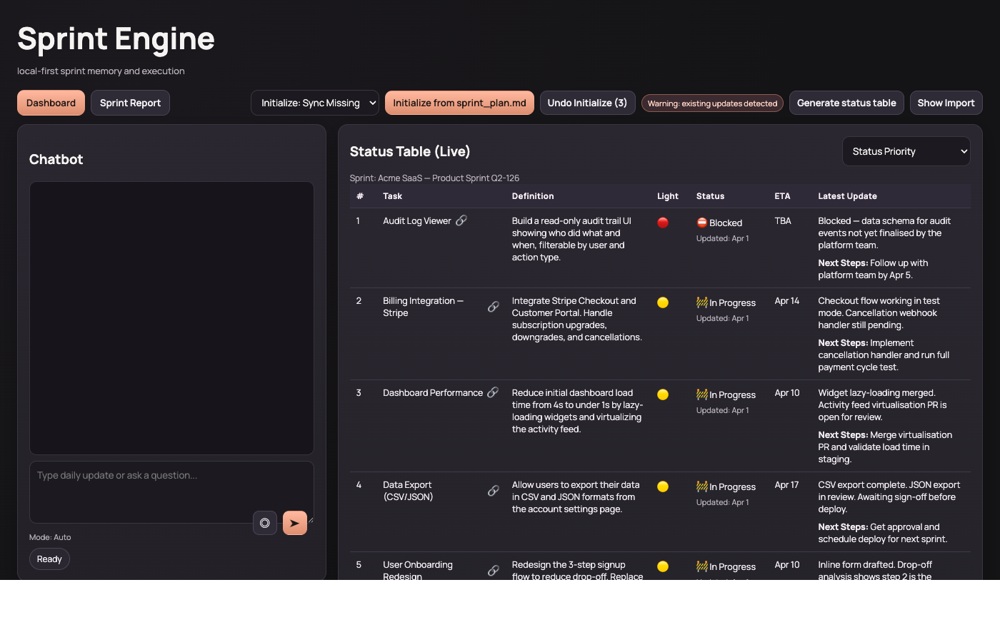

# Sprint Engine

A local-first sprint management copilot powered by LLM. Chat with your sprint, update task statuses in natural language, generate status tables, and get intelligent follow-up questions — all running on your machine with no external database.



## Features

- **Chat-driven updates** — describe progress in plain language; the engine parses and updates the sprint state
- **Traffic light tracking** — green / yellow / red per task, auto-updated from context
- **Smart follow-ups** — the engine asks about stale or blocked tasks at the right time
- **DOCX import** — paste a path to a `.docx` sprint plan; it is extracted and normalized to Markdown automatically
- **Table generation** — produce a formatted status table at any time
- **Daily logs** — every update is appended to a dated Markdown file under `workspace/daily_logs/`
- **Streamlit UI** — optional IDE-style frontend (`streamlit run streamlit_app.py`)

## Setup

```bash
python3 -m venv .venv
source .venv/bin/activate          # Windows: .venv\Scripts\activate
pip install -r requirements.txt
```

Configure environment:

```bash
cp .env.example .env
# Edit .env and set OPENAI_API_KEY=sk-...
```

If `OPENAI_API_KEY` is missing the app falls back to rule-based logic.

## Run

**FastAPI backend** (default port 8001):

```bash
python -m app.main
```

**Streamlit frontend** (optional, connects to the backend):

```bash
streamlit run streamlit_app.py
```

Then open `http://127.0.0.1:8001` for the built-in UI, or the Streamlit URL for the IDE-style layout.

## Workspace files

| Path | Purpose |
|------|---------|
| `workspace/sprint_plan.md` | Markdown sprint plan (source of truth) |
| `workspace/sprint_state.json` | Structured task state (auto-managed) |
| `workspace/daily_logs/` | One Markdown log file per day |
| `workspace/generated_tables/` | Generated status tables |

## Import a DOCX sprint plan

From the UI, use the **Import DOCX** panel and paste the absolute path to your file:

```
/path/to/your/sprint_plan.docx
```

The system will:
1. Extract text from the DOCX
2. Normalize to Markdown (via OpenAI if configured, fallback parser otherwise)
3. Write `workspace/sprint_plan.md`
4. Reinitialize `workspace/sprint_state.json`

## API endpoints

| Method | Path | Purpose |
|--------|------|---------|
| `POST` | `/api/initialize` | Initialize state from sprint plan |
| `POST` | `/api/import-docx-plan` | Import DOCX, write plan, optionally reinitialize |
| `POST` | `/api/chat` | Send a chat message / update |
| `GET`  | `/api/tasks` | List all tasks |
| `GET`  | `/api/followups` | Get pending follow-up questions |
| `GET`  | `/api/plan` | Return the raw sprint plan Markdown |
| `POST` | `/api/generate-table` | Generate a status table |

## Natural language task management

The chat endpoint understands task CRUD in natural language:

```
add "deploy new sitemap" as a new task, owned by Alice, due next Friday
remove "deploy new sitemap"
mark "URL canonicalization fix" as done
```

Task metadata includes `owner` and `eta`, both shown in the live table.

## Public / private mode switch

This repo ships with a mode toggle for sharing safely:

```bash
python set_mode.py public    # replace workspace with demo data — safe to push
python set_mode.py private   # restore your real sprint data
python set_mode.py status    # check current mode
```

**Public mode** stashes your real workspace files in `_private/` (gitignored) and puts generic demo data in their place.  
**Private mode** restores everything from `_private/` back to original locations.

Nothing is ever deleted — switching is always fully reversible.

## Environment variables

| Variable | Default | Purpose |
|----------|---------|---------|
| `OPENAI_API_KEY` | — | Required for LLM-powered parsing and chat |
| `OPENAI_MODEL` | `gpt-4o-mini` | Model to use |

## Requirements

See [requirements.txt](requirements.txt). Key dependencies: `fastapi`, `uvicorn`, `openai`, `python-docx`, `streamlit`.
